  

  
  
  
  

## Top Languages

  <picture>
    <source media="(prefers-color-scheme: dark)" srcset="./profile/top-langs-dark.svg" />
    <source media="(prefers-color-scheme: light), (prefers-color-scheme: no-preference)" srcset="./profile/top-langs-light.svg" />
    
  </picture>

